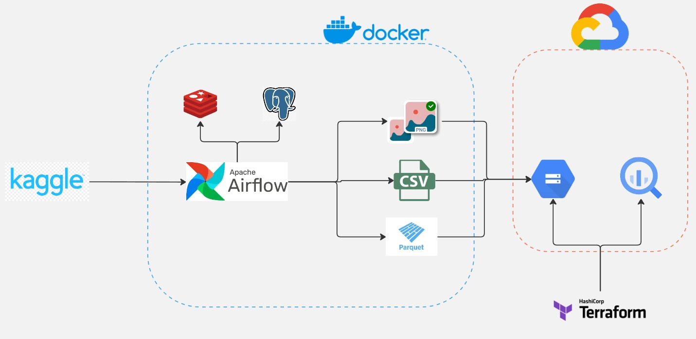

\
ETL Data Pipeline with Kaggle, Airflow, Celery, PostgreSQL, Google Cloud Storage, BigQuery and Terraform.

# Table of Contents

- [Table of Contents](#table-of-contents)
  - [Motivation](#motivation)
  - [Overview](#overview)
  - [Architecture](#architecture)
  - [New Personal Insights](#new-personal-insights)
  - [Prerequisites](#prerequisites)
  - [System Configuration](#system-configuration)

## Motivation
I wanted to build a pipeline that handles large amounts of images and their metadata seemlessly. I imagined supporting a team of machine learning engineers who would need a pipeline with standardized images to feed a developing model. The focus of this project was to sharpen my image parsing skills with python and writing refactorable code for similar purposes in the future. In future projects I will attempt to document my thought-process timeline in a dev_logs file.

## Overview
This pipeline is designed to:
1. [Extract](https://github.com/Shegzimus/DE_Fashion_Product_Images/blob/master/assets/Extract.png) data from Kaggle using its API
2. [Transform](https://github.com/Shegzimus/DE_Fashion_Product_Images/blob/master/assets/transform.png) the raw data by generating metadata, standardizing images, creating greyscale copies and changing column types
3. [Upload](https://github.com/Shegzimus/DE_Fashion_Product_Images/blob/master/assets/load.png) the data to GCS using folder oriented and flexible functions, and load the transformed data into BigQuery.
4. Perform aggregations on the image data and it's metadata.


## Architecture

1. **Kaggle API**: Source of the data.
2. **Apache Airflow & Celery**: Orchestrates the ETL process and manages task distribution.
3. **PostgreSQL**: Temporary storage and metadata management.
4. **Google Cloud Storage(GCS)**: Raw data storage.
5. **Google BigQuery(BQ)**: Data warehousing, analytics and SQL-based data transformation.

## New Personal Insights
I was able to learn the following new things as a result of building this pipeline:
1. Airflow's PythonOperator is flexible enough to [dynamically create tasks](https://github.com/Shegzimus/DE_Fashion_Product_Images/blob/95586fd0742ab4b83cca844da5ba46d2b37babe8/airflow/dags/load_dag.py#L59) based on input configurations. The ability to loop through a list of folder paths and generate individual tasks for each folder upload to GCS was an efficient approach I hadn't considered before.
2. While working on this pipeline, I found that [breaking down tasks into smaller, more focused functions](https://www.youtube.com/watch?v=rXjf8eiGsSI) really helped me stay on top of the development process. By using function decomposition, I was able to write [cleaner, more manageable code](https://github.com/Shegzimus/DE_Fashion_Product_Images/blob/master/airflow/pipelines/load.py) where each function had a single responsibility. This made debugging, testing, and extending the code much easier, and overall improved how I approached the project.
3. I recently learned about the use of 
```python
sys.path.insert(0, os.path.dirname(os.path.dirname(os.path.abspath(__file__))))
``` 
during development, and it was a game changer for managing imports across different files. This line allows me to modify the Python path dynamically, making it easier to call functions from other files without running into import errors. It’s a small addition, but it really streamlined how I structure and reference my code in larger projects.

4. One thing I realized while working on this project is the functional difference between [declaring volumes](https://github.com/Shegzimus/DE_Fashion_Product_Images/blob/b3507388b648b905d4eb46bff856d4be296fd684/airflow/docker-compose.yml#L10) in the Docker Compose file and [copying them in the Dockerfile](https://github.com/Shegzimus/DE_Fashion_Product_Images/blob/b3507388b648b905d4eb46bff856d4be296fd684/airflow/DockerFile#L44). By doing this, I can link external files or directories to the container at runtime, which means I can modify data or configurations without having to rebuild the container. This let me save time, especially when I needed to make configuration changes or work with persistent data.
   
5. By avoiding [unnecessary packages](https://github.com/Shegzimus/DE_Fashion_Product_Images/blob/b3507388b648b905d4eb46bff856d4be296fd684/airflow/DockerFile#L39) like gosu and vim, I saw that I can keep the container lightweight, reducing its attack surface and improving its overall performance. It reminded me that containers should be as simple as possible, with everything needed for production tasks and not much else.

## Prerequisites
1. Google console account with appropriate permissions for GCS and BigQuery
2. Kaggle API Credentials
3. Terraform installation
4. Docker Installation
5. Python 3.11 or higher

## System Configuration
1. Clone the repository
    ```bash
    git clone https://github.com/Shegzimus/DE_Fashion_Product_Images.git
    ```

2. Create a virtual environment in your local machine
    ```bash
    python3 -m venv venv
    ```


3. Activate the virtual environment
    ```bash
    source venv/bin/activate
    ```

4. Install dependencies
   ```bash
   pip install -r airflow/requirements.txt
   ```

5. Create directories to store your google and kaggle credentials
   ```bash
   cd airflow && mkdir -p .google .kaggle

   ```

6. Generate and place your google service account credentials in the .google file the terraform file

7. Generate and place your kaggle credentials in the .kaggle file

8. Adjust the DockerFile and docker-compose configuration to reflect these changes

9.  Build the Docker Image
    ```bash
    docker build -d --
    ```

10. Start the Docker containers
    ```bash
    docker-compose up -d
    ```

11. Launch the Airflow web UI
    ```bash
    open http://localhost:8081
    ```